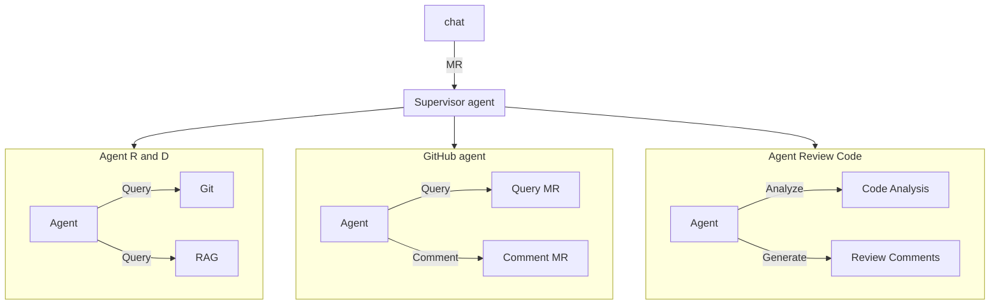
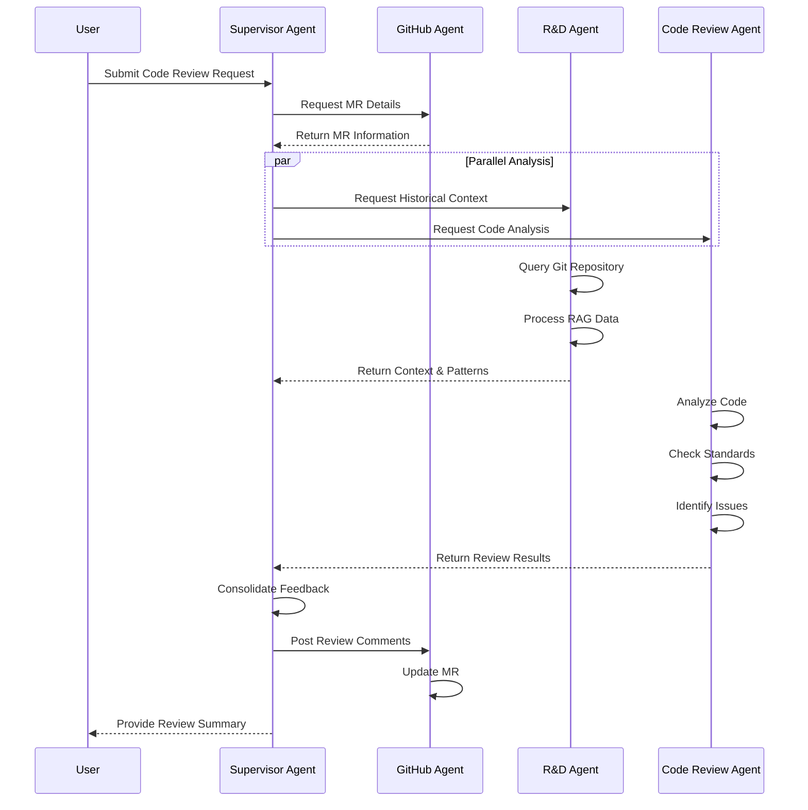

# Code Review Agent System

The Code Review Agent System is an intelligent, automated solution designed to streamline the code review process. This system leverages AI agents to analyze code, provide insightful feedback, and facilitate collaboration between developers.

The system consists of multiple specialized agents working together:
- A Supervisor Agent that coordinates all activities
- A GitHub Agent that interfaces with pull requests and merge requests
- An R&D Agent that accesses git history and uses RAG (Retrieval-Augmented Generation) for context
- A Code Review Agent that performs detailed code analysis and generates review comments

By automating routine aspects of code review, this system helps development teams:
- Improve code quality through consistent and thorough reviews
- Reduce the time spent on manual reviews
- Accelerate the development cycle
- Ensure coding standards are maintained

## System Architecture Diagram




## Workflow Steps Diagram
The following sequence diagram illustrates the complete workflow of the code review system, from initial request to final delivery of review results. It shows how the different agents interact with each other and the sequence of operations performed during a code review process.

The workflow demonstrates:
- How user requests are processed by the Supervisor Agent
- The information gathering phase through the GitHub Agent
- Parallel processing of context and code analysis
- The consolidation of feedback from multiple sources
- The delivery of comprehensive review results back to the user
  This orchestrated approach ensures efficient processing while maintaining thorough analysis of the code under review.



This sequence diagram shows:
1. Initial user request
2. Supervisor Agent coordination
3. GitHub Agent MR retrieval
4. Parallel processing by R&D and Code Review agents
5. Detailed steps within each agent
6. Result consolidation
7. Final feedback posting and user notification

The diagram helps visualize the temporal flow and interactions be

## Required Libraries
The following libraries are required to run this project:
- ollama (https://ollama.com/) 
- python venv  (Python 3.9.6)

## Installation
To install the required dependencies, run:
```bash
  python3 -m venv venv
  source venv/bin/activate
  pip install --upgrade pip
  pip install -r requirements.txt
```
## How to start the project
1. Active the virtual environment:
```bash
  source venv/bin/activate
```

2. Run ML model:
```bash
    ollama run llama3
```

3. Run the web app:
```bash
    langflow run
```

